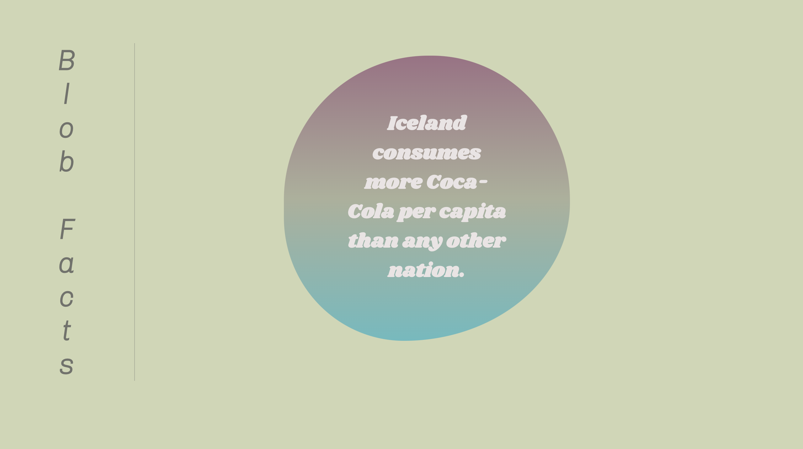
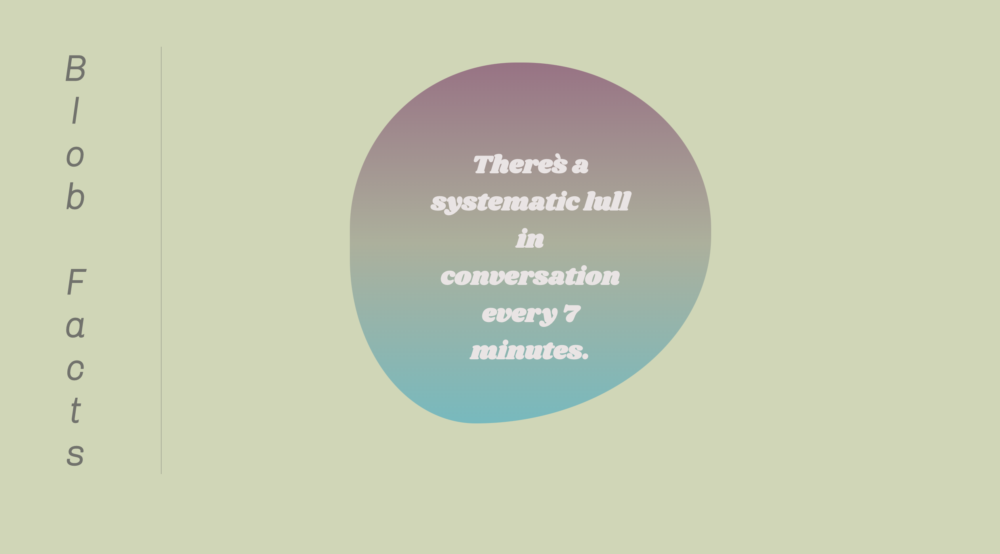

# Blob Facts

Press the Blob - Receive a fact

(not of interest: the blob is animated and pulses pleasingly on the page)

## Tech
- React
- Javascript
- Html
- Css
- Json
- API: https://uselessfacts.jsph.pl//random.json?language=en